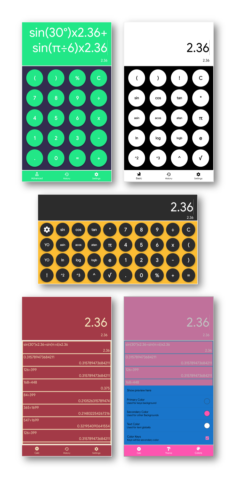

# FabCalc

A colorful calculator created for learning android, with literraly millions of possible color combinations. Supports RGB input for primary, secondary and text colors. May have some bugs, but mostly works fine.

## Features
- Simple arithmetic operations.
- Advanced operations including trigonometric, logarithmic and exponential operations.
- 12 points pico-precision.
- History of all operations, which can be cleared or disabled.
- Completely themeable interface, with millions of possible color combinations.

## TODO
- Fix some minor bugs.
- Add more theming options (images, blur, flat, single color etc.)

## LICENSE

Copyright (C) 2019 Aakarshit Uppal

No part of the code in this repository may be used in any way, commercially or otherwise, without the express, written permission of the author.

(I'll switch to a less strict license once this app is finished and released)
